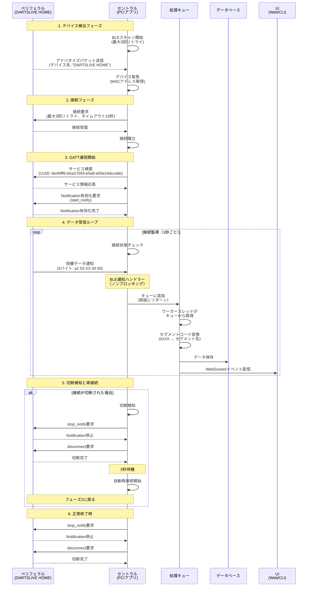
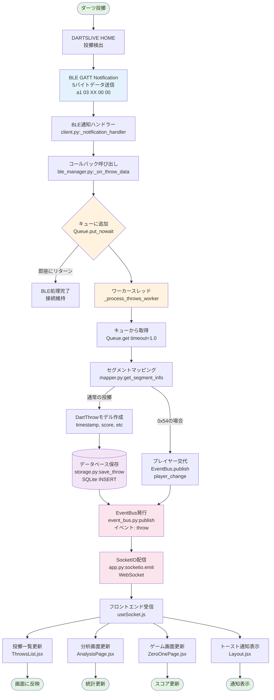

# DARTSLIVE HOME データ取得・分析アプリケーション

DARTSLIVE HOMEからBluetooth Low Energy (BLE) 経由でダーツの投擲データを取得し、リアルタイムで分析・可視化するPythonアプリケーションです。

## 特徴

- 🎯 **リアルタイムデータ取得**: BLE GATT通信でダーツの投擲データをリアルタイムに取得
- 💾 **データ保存**: SQLiteデータベースに投擲データを自動保存
- 📊 **データ分析**: 統計情報、セグメント分布、精度分析、日付フィルター機能
- 🌐 **Webアプリケーション**: Flask + React によるリアルタイムダッシュボード
  - WebSocket (Socket.IO) によるリアルタイム更新
  - Framer Motionによる滑らかなアニメーション
- 🔄 **自動再接続**: 接続監視と自動再接続で安定した動作
- 🎮 **ゲームモード**: ゼロワン(01)ゲームの実装
  - 301/501/701/1001 から選択可能
  - ダブルアウト、マスターアウト、ストレートアウト対応
  - 複数プレイヤー対応
  - プレイヤー交代ボタン検出
- ⚡ **非同期処理**: キューベースの非同期データ処理で安定したBLE接続
- ✅ **テストカバレッジ**: 主要機能の単体テスト実装済み

## 必要要件

- Python 3.8以上
- Bluetooth 4.0以上対応のハードウェア
- DARTSLIVE HOME デバイス

## インストール

### 1. リポジトリのクローン

```bash
git clone <repository-url>
cd BLE_get_Darts_Live_Home_Info
```

### 2. 依存関係のインストール

```bash
pip install -r requirements.txt
```

開発用 (テストを含む):

```bash
pip install -r requirements-dev.txt
```

## 使い方

このアプリケーションは **CLIモード** と **Webアプリモード** の2つの実行モードがあります。

### Webアプリモード（推奨）

リアルタイムダッシュボード、統計分析、ゲームモードなどを備えたWebアプリケーションです。

```bash
# バックエンド起動
python web_app.py

# 別ターミナルでフロントエンド起動（開発モード）
cd frontend
npm install  # 初回のみ
npm run dev
```

ブラウザで `http://localhost:3000` を開いてください。

詳細は [README_WEB.md](README_WEB.md) を参照してください。

### CLIモード

コマンドラインでシンプルにデータを取得・表示します。

```bash
python -m src.main
```

アプリケーションが起動すると、以下の処理が自動的に実行されます:

1. DARTSLIVE HOMEデバイスをスキャン
2. デバイスに接続
3. データ受信を開始
4. ダーツを投げると、投擲データがリアルタイムに表示・保存されます

終了するには `Ctrl+C` を押してください。

**注意**: CLIモードとWebアプリモードは同時に実行できません（BLEデバイスは1接続のみ）。

### 実行例

```
============================================================
DARTSLIVE HOME データ取得アプリケーション
============================================================

📡 DARTSLIVE HOMEデバイスを検索中...
✅ DARTSLIVE HOMEデバイスを発見: DARTSLIVE HOME (AA:BB:CC:DD:EE:FF)
🔗 デバイスに接続中...
✅ 接続成功: DARTSLIVE HOME
🎯 データ受信を開始...

✅ 準備完了! ダーツを投げてください
   (終了するには Ctrl+C を押してください)

🎯 投擲検出: ダブル20 (40点) [ID: 1]
🎯 投擲検出: トリプル20 (60点) [ID: 2]
🎯 投擲検出: シングル1 (1点) [ID: 3]
```

## プロジェクト構成

```
BLE_get_Darts_Live_Home_Info/
├── src/                        # コアモジュール（CLI/Web共通）
│   ├── ble/                    # BLE通信モジュール
│   │   ├── constants.py        # 定数定義
│   │   ├── scanner.py          # デバイススキャン
│   │   └── client.py           # BLE接続・データ受信
│   ├── data/                   # データ管理モジュール
│   │   ├── models.py           # データモデル
│   │   ├── mapper.py           # セグメントマッピング
│   │   ├── storage.py          # データ保存 (SQLite)
│   │   └── analyzer.py         # データ分析
│   ├── core/                   # コアモジュール
│   │   ├── config.py           # 設定管理
│   │   └── logger.py           # ログ設定
│   └── main.py                 # CLIエントリーポイント
├── backend/                    # Webアプリケーション（バックエンド）
│   ├── app.py                  # Flask + SocketIO サーバー
│   ├── ble_manager.py          # BLE接続管理（非同期キュー処理）
│   ├── event_bus.py            # イベントバス（Pub/Sub）
│   ├── api/                    # REST API
│   │   ├── throws.py           # 投擲データAPI
│   │   ├── stats.py            # 統計API
│   │   └── games.py            # ゲームAPI
│   └── games/                  # ゲームロジック
│       ├── base.py             # ゲーム基底クラス
│       ├── zero_one.py         # ゼロワンゲーム
│       └── state.py            # ゲーム状態管理
├── frontend/                   # Webアプリケーション（フロントエンド）
│   ├── src/
│   │   ├── components/         # Reactコンポーネント
│   │   │   ├── Layout.jsx      # 共通レイアウト
│   │   │   └── DateRangeFilter.jsx # 日付フィルター
│   │   ├── pages/              # ページコンポーネント
│   │   │   ├── ThrowsList.jsx  # 投擲一覧
│   │   │   ├── AnalysisPage.jsx # 分析画面
│   │   │   └── ZeroOnePage.jsx # ゼロワンゲーム
│   │   ├── hooks/              # カスタムフック
│   │   │   ├── useSocket.js    # WebSocket接続
│   │   │   └── useGame.js      # ゲーム状態管理
│   │   ├── services/           # API/WebSocketクライアント
│   │   │   ├── api.js          # REST APIクライアント
│   │   │   └── socket.js       # Socket.IOクライアント
│   │   ├── App.jsx             # ルートコンポーネント
│   │   ├── main.jsx            # エントリーポイント
│   │   └── index.css           # グローバルスタイル
│   ├── package.json
│   └── vite.config.js
├── tests/                      # テストコード
│   ├── test_models.py
│   ├── test_mapper.py
│   ├── test_storage.py
│   └── test_analyzer.py
├── data/                       # データベース格納ディレクトリ
├── requirements.txt            # 本番用依存関係
├── requirements-web.txt        # Web用依存関係
├── requirements-dev.txt        # 開発用依存関係
├── web_app.py                  # Webアプリエントリーポイント
├── README.md                   # このファイル
└── README_WEB.md               # Webアプリケーションの詳細
```

## テスト

テストを実行するには:

```bash
pytest
```

カバレッジレポート付き:

```bash
pytest --cov=src --cov-report=html
```

## データベース

投擲データは `data/dartslive.db` に保存されます。

### データベーススキーマ

**dart_throws テーブル:**
- id: 投擲ID
- timestamp: 投擲時刻
- segment_code: セグメントコード (生データ)
- segment_name: セグメント名 (例: "ダブル20")
- base_number: 基本数字 (1-20, 25)
- multiplier: 倍率 (1: シングル, 2: ダブル, 3: トリプル)
- score: 得点
- device_address: デバイスMACアドレス
- device_name: デバイス名

## セグメントマッピングについて

✅ **実機テスト完了**: セグメントマッピングは実機（DARTSLIVE HOME）でテストして確認済みです。全62セグメント（シングル20 + ダブル20 + トリプル20 + ブル2）が正確にマッピングされています。

### マッピング構造

| セグメントコード | エリア | 詳細 |
|---------------|--------|------|
| 0x01 - 0x14 | シングル1-20（内側） | 1から20まで順番 |
| 0x15 - 0x28 | シングル1-20（外側） | 1から20まで順番 (20は0x28) |
| 0x29 - 0x3c | ダブル1-20 | 1から20まで順番 |
| 0x3d - 0x50 | トリプル1-20 | 1から20まで順番 |
| 0x51 | アウターブル | 25点 |
| 0x52 | インナーブル | 50点 |
| 0x54 | プレイヤー交代ボタン | 特殊なボタン (得点0点) |

### 注意事項

⚠️ **シングルエリアの区別**: DARTSLIVE HOMEはシングルエリアを内側と外側の2つに分けて検出します。通常のダーツボードでは区別されませんが、このデバイスでは内側(0x01-0x14)と外側(0x15-0x28)が別々に記録されます。

⚠️ **プレイヤー交代ボタン**: プレイヤー交代ボタン（0x54）は特殊なボタンとして扱われます。`base_number=0`, `multiplier=0`, `score=0` で記録されるため、データ分析時に通常の投擲と区別できます。Webアプリケーションのゲームモードで自動的にプレイヤー交代に使用されます。

## システムアーキテクチャ

### BLE接続フロー（ペリフェラル ↔ セントラル）



### 投擲検出から画面反映までのフロー



**フローの特徴:**

1. **非同期処理**: BLE通知ハンドラーは即座にキューに追加してリターン（ブロッキングなし）
2. **ワーカースレッド**: 別スレッドでDB書き込みとイベント配信を処理
3. **接続安定性**: BLE通信をブロックしないため、接続が切れにくい
4. **リアルタイム**: WebSocketで全クライアントに即座に配信
5. **自動再接続**: 切断検知時に自動的に`stop_notify()` → `disconnect()` → 再接続

## 設定のカスタマイズ

`src/core/config.py` で以下の設定を変更できます:

- データベースパス
- スキャン・接続のタイムアウト設定
- リトライ回数と間隔
- ログレベル
- データ保持期間

## トラブルシューティング

### デバイスが見つからない

1. DARTSLIVE HOMEの電源が入っているか確認
2. Bluetoothがオンになっているか確認
3. デバイスが近くにあるか確認（推奨: 1m以内）
4. 他のBLEアプリケーションとの競合がないか確認
5. アプリケーションは最大3回自動リトライします

### 接続が切れる（修正済み）

**✅ 最新版では以下の改善により接続が安定しています:**

- **非同期キュー処理**: BLE通知ハンドラーがブロックされない
- **接続監視**: 1秒ごとに接続状態をチェック
- **適切なクリーンアップ**: `stop_notify()` → `disconnect()` の順で実行
- **自動再接続**: 切断検知時に3秒後に自動再接続

**それでも接続が不安定な場合:**
- デバイスとの距離を近づける（推奨: 50cm以内）
- Bluetooth信号を妨害する障害物（金属、電子レンジなど）がないか確認
- ログを確認して切断の原因を特定:
  ```bash
  # ログレベルをDEBUGに変更
  export LOG_LEVEL=DEBUG
  python web_app.py
  ```

### データが正しく表示されない

- セグメントマッピングは実機テスト済みで正確です
- ログレベルをDEBUGに変更して詳細情報を確認:
  ```python
  # src/core/config.py
  log_level: str = "DEBUG"
  ```
- WebSocket接続状態を確認（ブラウザの開発者ツール → Network → WS）

### Webアプリが起動しない

**バックエンド:**
```bash
# 依存関係が正しくインストールされているか確認
pip install -r requirements-web.txt

# ポートが使用中でないか確認
lsof -i :5000  # macOS/Linux
netstat -ano | findstr :5000  # Windows
```

**フロントエンド:**
```bash
# Node.jsのバージョン確認（推奨: 16以上）
node --version

# 依存関係を再インストール
cd frontend
rm -rf node_modules package-lock.json
npm install
```

## 将来の機能拡張

このプロジェクトは、将来的に以下の機能を追加することを想定して設計されています:

- 📱 **複数デバイス対応**: 複数のDARTSLIVE HOMEデバイスの同時接続
- 📈 **高度な統計分析**: 時系列分析、上達度トラッキング
- 🎮 **追加ゲームモード**: クリケット、カウントアップなど
- 👥 **マルチプレイヤー強化**: 複数プレイヤーの記録・比較、ランキング機能
- ☁️ **クラウド同期**: データのクラウドバックアップ・同期

## 技術スタック

### コア
- **BLE通信**: bleak
- **データベース**: SQLite
- **データ分析**: pandas
- **非同期処理**: asyncio

### バックエンド (Web)
- **Webフレームワーク**: Flask
- **WebSocket**: Flask-SocketIO, python-socketio
- **CORS**: Flask-CORS
- **非同期サーバー**: eventlet

### フロントエンド
- **UIライブラリ**: React 18
- **ビルドツール**: Vite
- **ルーティング**: React Router
- **WebSocket**: Socket.IO Client
- **アニメーション**: Framer Motion

### 開発ツール
- **テスト**: pytest, pytest-asyncio, pytest-cov
- **モック**: pytest-mock

## ライセンス

このプロジェクトはMITライセンスの下で公開されています。

## 参考資料

- [サルでもわかるBLE入門](https://www.musen-connect.co.jp/blog/course/trial-production/ble-beginner-1/)
- [bleak ドキュメント](https://bleak.readthedocs.io/)

## 貢献

バグ報告、機能リクエスト、プルリクエストを歓迎します!

## お問い合わせ

問題や質問がある場合は、Issueを作成してください。
